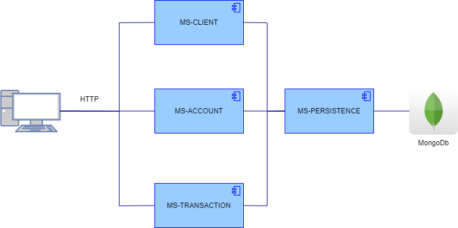

# boot-camp-project MS
Proyecto multi module implementado para el boot camp MS

## Componentes

- **ms-database** - Componente que mantiene la capa persistente a la base de datos MongoDB
- **ms-commons-base** - Objetos DTO
- **ms-client**
- **ms-account**
- **ms-transaction**

***
Se añade archivo export POSTMAN para la prueba de los servicios REST